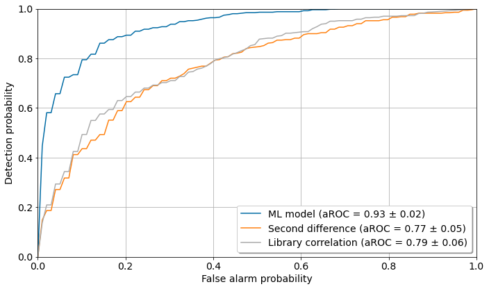

# ML peak detection for gamma-ray spectrometry

This repository hosts the prototype of my dissertation project, a supervised peak detection algorithm using machine learning techniques. It was expanded during my master's degree in Environmental Sciences with focus on machine learning at Universidade Estadual Paulista (UNESP). For more details about the project, please read [my dissertation on the UNESP repository](https://repositorio.unesp.br/handle/11449/148825) (in Portuguese).

## Summary 

Usage of radioactive elements is present in several areas of science and technology, requiring efficient, accurate, and sustainable ways of environmental conservation and human health monitoring. Gamma-ray spectrometry is an efficient and non-destructive analysis technique for identification of gamma-ray emitting elements. Nonetheless, current analysis softwares have certain limitations regarding environmental samples, whose radioactivity concentration is often close to the detection limit, or when certain radionuclides of interest are subject to interference. This work aims the development of an analysis algorithm using machine learning to achieve better performance than the methods in classical radiometric analysis software. 

The algorithm in this project comprises a wavelet transform, a feature extraction routine with Random Forests, and a linear classifier. In tests with artificial spectra, it outperformed classical spectrometry algorithms (such as the Unidentified Second Difference and Library Correlation Nuclide Identification) at every metric. However, this advantage decreases as the signal-to-noise ratio of the spectra increases, becoming negligible when the signal-to-noise ratio exceeds the detection limit.



The dataset used in this repository was artificially generated as to mimick real-life conditions in a spectrometry laboratory. The actual data obtained during experiments with radioactive sources are not  publicly available due to the laboratory's property rights.

## Project structure
- [data/](./data/) - dataset in Python pickle format
- [helpers/](./helpers/) - auxiliary functions used in the notebooks
- [./notebooks/](./notebooks/)
    - [01-about-the-data.ipynb](./notebooks/01-about-the-data.ipynb) - how the dataset was generated, including a few statistics about it
    - [02-feature-extraction.ipynb](./notebooks/02-feature-extraction.ipynb) - usage of wavelet transform to clean the spectra, and feature selection
    - [03-classification.ipynb](./notebooks/03-classification.ipynb) - actual results

## Try the notebooks

In your shell prompt, type the following:

```sh
git clone https://github.com/brunoarine/ML-peak-detection.git
```

## Dependencies

- matplotlib 3.3.4
- scipy 1.6.1
- seaborn 0.11.1
- pandas 1.2.3
- numpy 1.20.1
- scikit-learn 0.24.1

## Requirements

- scipy 1.6.1+
- numpy 1.20.1+
- matplotlib 3.3.4+
- scikit-learn 0.24.1+

## Acknowledgements

[Antonio Cesar Germano Martins](https://www.sorocaba.unesp.br/#!/antonio), outstanding supervisor and friend.

